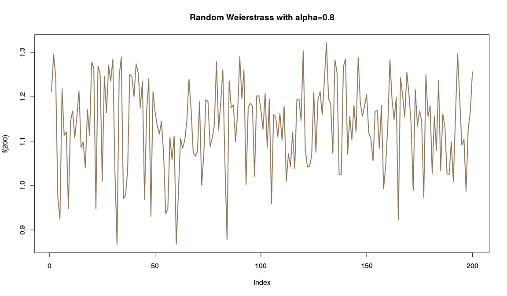
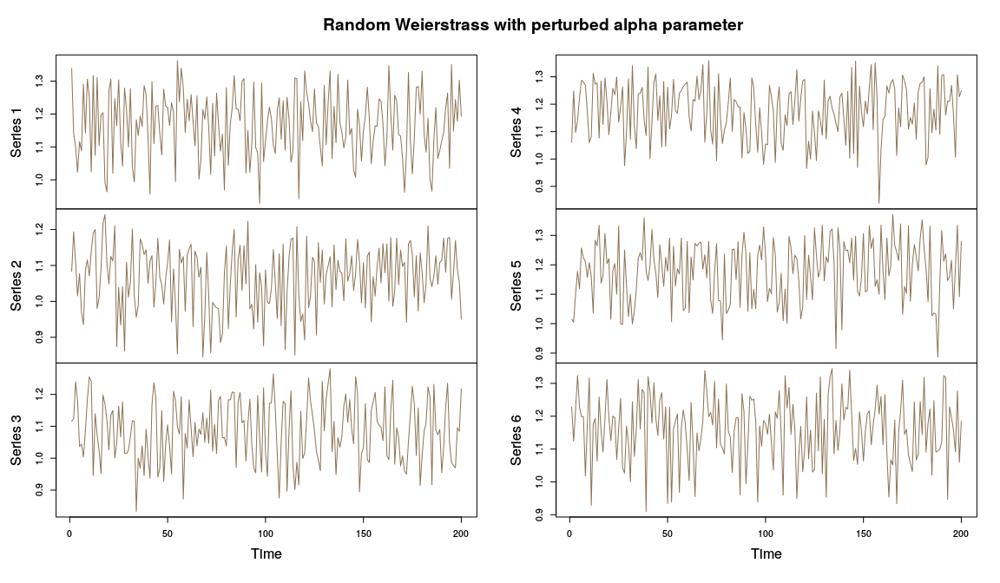

<!-- README.md is generated from README.Rmd. Please edit that file -->
tssims
======

This package contains a small set of simulation functions. The fractional Brownian motion and FARIMA functions are wrappers for the corresponding functions in the fArma and fracdiff packages, respectively.

The simulation 'model' is created separately from the function. This was done to enable easier randomization of the model parameters using the `jitter_params` function.

Example
=======

Calling the base simulation function generates the model parameters. The `gen` returns a function which takes a single length parameter.

``` r
# The model
alpha = 0.8
mod <- weierstrass(alpha)
# The function
f <- gen(mod)
plot(f(200), type = 'l', 
             lwd = 2, 
             col = "burlywood4", 
             main = paste0("Random Weierstrass with alpha=", alpha))
```



Jitter
======

The parameter model for the function can be perturbed using the `jitter_params` function.

``` r
mod <- weierstrass(0.8)
# Create 6 versions with perturbed parameters
fs <- replicate(6, gen(jitter_params(mod))(200))
plot.ts(fs, 
        main = "Random Weierstrass with perturbed alpha parameter",
        col = "burlywood4")
```


